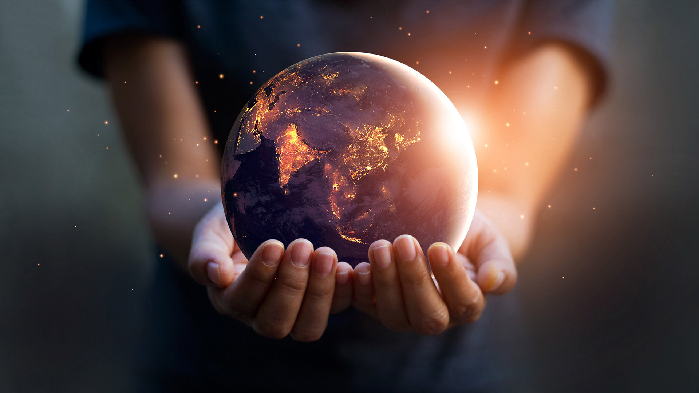

What is wrong with the world?

How did we end up developing a thick skin for the humanitarian and environmental crises around us?

When did we decide to close our hearts and not care?

Existential collapse threatens our society. But day after day, we carry on with business as usual. We choose to ignore the inconvenient truth and instead bury ourselves under a blanket of comforting lies.

So what stops us from acting now? One theory is the human adaptation of biased thinking. Our mind bundles together all of the alarming events that we are experiencing and brushes them aside to better fit the narrative. Our brains have developed a selective reality to let us cope with actual reality.

The desire to leave a legacy motivates us to live. This desire may stem from a selfish desire of not being forgotten, or possibly, from a selfless hope to give back to the world. But what is a legacy worth if there are none alive to inherit it?

Our forests are burning, and our ecosystems are collapsing. Our resources are depleting and over a million species facing extinction. We've replaced the fish in our oceans with plastic and the birds in our skies with smoke. We've racked up debt on our planet, and soon we'll have to pay up. When is enough, enough?

We broke the world. And now we have to fix it.

The Internet has empowered us to make connections around the world. We strive for a chance to be heard, to share our thoughts and ideas with the world. But our voices are lost in the noise of algorithms that bombard us with fake news and censor our real voices. Corporations and governments rewrite narratives before our eyes to fit their selfish agendas.

But maybe we do want the truth. Even if that truth that sometimes hurts, shocks, frightens, or brings us to tears. Because, after all, pain is what leads us to change.

We cannot hide from it anymore. This quest for power has to stop. These organizations, which wield enormous influence, need to be held accountable. We have to start somewhere. Despite their failings, social networks do allow us to drive awareness of critical global issues.

We, as individuals, may lack the agency and the leverage to improve the world on a massive scale. How can one of us solve global coordination problems? How can one of us tap into the climate anxiety that all of us feel, but feel powerless to do anything about?

What if we create a venue where everyone can share their thoughts and ideas? What if we listen to those who don't have a voice? What if we join forces so that together we can make a difference? These are some of the questions we have been struggling with.

And then along the way, something happened. The voice of one became the voice of many, and Virgo was born. This idea is now evolving into a community that empowers everyone to weigh in on tragedies of the commons, crowdfund answers, and keeps funded organizations accountable through blockchain. We aim to solve global problems by providing fundamental tools for human coordination and organization in the 21st century.

Together we'll have the power to stop the imminent destruction of our world. We foresee that it will require an entire reorganization of our social, economic, and political systems. It may be a massive task, but we are ready!

Virgo's core values are equality, transparency, and accountability. Through equality, we can establish new governments by the will of the people. Through transparency, we will be able to keep political dialog honest. Through accountability, we will be able to observe the real effects of the leadership that we elect.

Join us. Let's build a better future together, united under Virgo.
